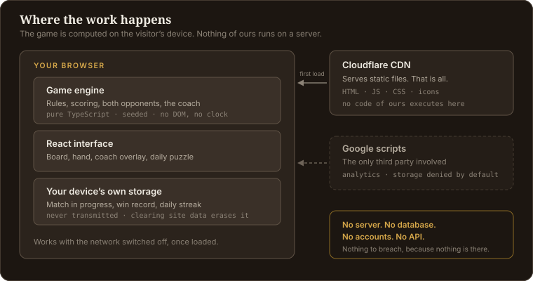

# Dominoes — Block & Draw

**A dominoes game that shows you its thinking.** Play Block or Draw against an AI
opponent, and when you are stuck, ask the board: the coach tells you the best move
and explains *why* in plain English. No account, no download, no app store.

### ▶ Play it now — **[playdomino.app](https://playdomino.app)**

Free, opens instantly, works offline, and nothing you do leaves your device.

---

## The problem

Browser dominoes is a bad neighbourhood. The typical game asks you to make an
account before you can play a single tile, buries the board in ads that intercept
your taps, and — the part that actually matters — teaches you nothing. You lose,
you have no idea why, and you play the same mistake again next round.

The rules of dominoes take two minutes to learn. Playing *well* takes a long time,
because the important decisions are invisible: which numbers you are quietly
running out of, which end your opponent cannot answer, when to dump weight and
when to hold it.

## The solution

Two decisions shape the whole product.

**The coach and the opponent share one brain.** The "Sharp" opponent scores every
candidate move on pips shed, double flexibility, suit spread and end control. The
coach runs *that same evaluation* and shows you the top of it, with the factors
that decided it:

> **Play [6|1] on the 6 end, leaving a 1 showing** — sheds 7 points from your
> hand, and you still hold two more 1s to answer that end.

So the advice is not generic tips. It is literally the reasoning you are up
against, which makes losing instructive instead of annoying.

**Nothing asks for anything.** No sign-up, no email, no cookie wall. The board is
the first thing you see, and your match, record and streak live in your own
browser and go nowhere else.

---

## What stands out

**A coach with no cloud behind it.** The explanations are generated from the
evaluation's own numbers, not written by a language model and not fetched from a
server. That means the reasoning is always exactly true to the move it is
describing, it answers instantly, and it works on a plane.

**Friend challenges without a backend.** Every shuffle comes from a seeded
generator, so a short link like `playdomino.app/play?seed=K7KDQ1ZH` deals your
friend the *identical* tiles you played. Your score rides along in the URL and the
two results render side by side when they finish. No accounts, no matchmaking, no
server — a URL is the entire multiplayer infrastructure.

**Hand of the Day.** One puzzle a day, the same deal for every player on earth,
derived from a hash of the UTC date and machine-checked to be winnable inside the
move budget before it is served. Streaks included. Also with no server: the date
*is* the puzzle.

**Plays offline, installs like an app.** Add it to a phone home screen and it runs
with no connection at all — engine, opponents and coach included, because none of
them ever needed a network.

---

## How it is built, and why

The stack is deliberately small: **React 19, TypeScript in strict mode, Vite and
Tailwind, with three runtime dependencies in total** (`react`, `react-dom`,
`react-router-dom`). Each choice below was made for a reason worth stating.

  

### Static-first, with no backend of our own

There is no server, no database and no API. The site is static files on a CDN, and
every rule, every opponent decision and every score is computed in the visitor's
browser.

This is primarily a **security** decision rather than a cost one. A static site has
almost no server-side attack surface: no login endpoint to brute-force, no database
to inject into, no session to steal, no host to root. The strongest way to protect
user data is to never collect it, and the strongest way to survive an attack is to
have nothing on the server worth taking.

It also means the hosting bill is zero and the privacy policy is short and true.

### A seeded generator, injected from the first commit

`Math.random()` appears nowhere in the game engine. The engine takes a pseudo-random
generator as an argument, and every shuffle, every draw order and every bot
tie-break flows through it.

This was built on day one, not retrofitted, and that ordering was the point. Same
seed in, identical game out, on any device — which is what makes the challenge
links, the daily puzzle and reproducible bug reports *fall out of the design* rather
than needing features built for them. Adding determinism later would have meant
rewriting and re-testing the engine core.

(The generator is for fairness and reproducibility, never for security. Anywhere an
unguessable value is needed, that comes from `crypto.getRandomValues()`.)

### An engine that knows nothing about browsers

`src/engine/` is pure TypeScript: no React, no DOM, no storage, and no reading of
the clock. Every state transition is a pure function of the form
`(state, action) => newState`, with no mutation.

Three things follow. It runs in plain Node, which makes it an ideal test target —
**184 tests**, including a property test that plays 1,000 seeded bot-versus-bot
matches and asserts tile conservation never breaks (hands + boneyard + line = 28,
always). Undo comes free from the move history. And the whole engine could be lifted
into a native app without touching a line of it.

A linter rule enforces the boundary, so the purity cannot quietly erode.

### Bots that are heuristics, not searches

The Sharp opponent runs no game-tree search. It weighs each legal move on pip value
shed, playing doubles early while they are still placeable, keeping a hand that
spans many numbers, and steering the open ends toward numbers it holds. It infers
what an opponent lacks from their passes, because a pass is permanent proof.

Measured over **500 seeded head-to-head matches, Sharp beats the Rookie bot 78.2%
of the time** (391 wins), and it decides a move in under a millisecond. A search
would be slower, far harder to explain, and no more fun to play against — and being
explainable is the whole feature.

### Rendering the content pages at build time

Google runs JavaScript. Bing, the social-card scrapers and the AI crawlers largely
do not. So the build renders every content route to real HTML with its prose,
canonical URL and `HowTo`/`FAQPage` structured data already in the file — no
framework, no server, just a Node script that renders the same React components the
browser uses. **5,230 words** of original rules, scoring, strategy and FAQ content
ship as HTML that needs no script to read.

The game screens stay client-rendered, which is correct: a board that depends on a
seed and a saved match has nothing static to prerender.

### Performance and safety as build requirements

First load is about **113 kB gzipped**, all in. Three dependencies keep both the
supply-chain surface and the bundle small, and they are the same decision: Core Web
Vitals affect search ranking, and every dependency is code someone else can change.

A strict Content Security Policy ships with the site, with no `unsafe-inline` and no
`unsafe-eval` in `script-src`. `dangerouslySetInnerHTML` and `eval` appear nowhere,
and a linter rule keeps it that way, so a reflected-XSS attempt could not execute
even if an input-validation bug let attacker text reach the page. Every URL
parameter — the seed most of all — is parsed against a strict allowlist and falls
back silently to a clean game rather than echoing anything back.

---

## About this repository

This repo is a **showcase, not the source**. It holds this write-up and its images.
The application code, deployment configuration and build pipeline live in a private
repository.

If you want to see the thing itself, the best version of it is the live one:
**[playdomino.app](https://playdomino.app)**.
